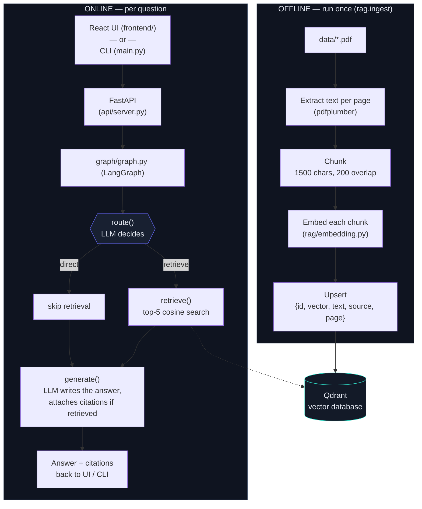
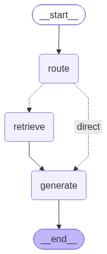
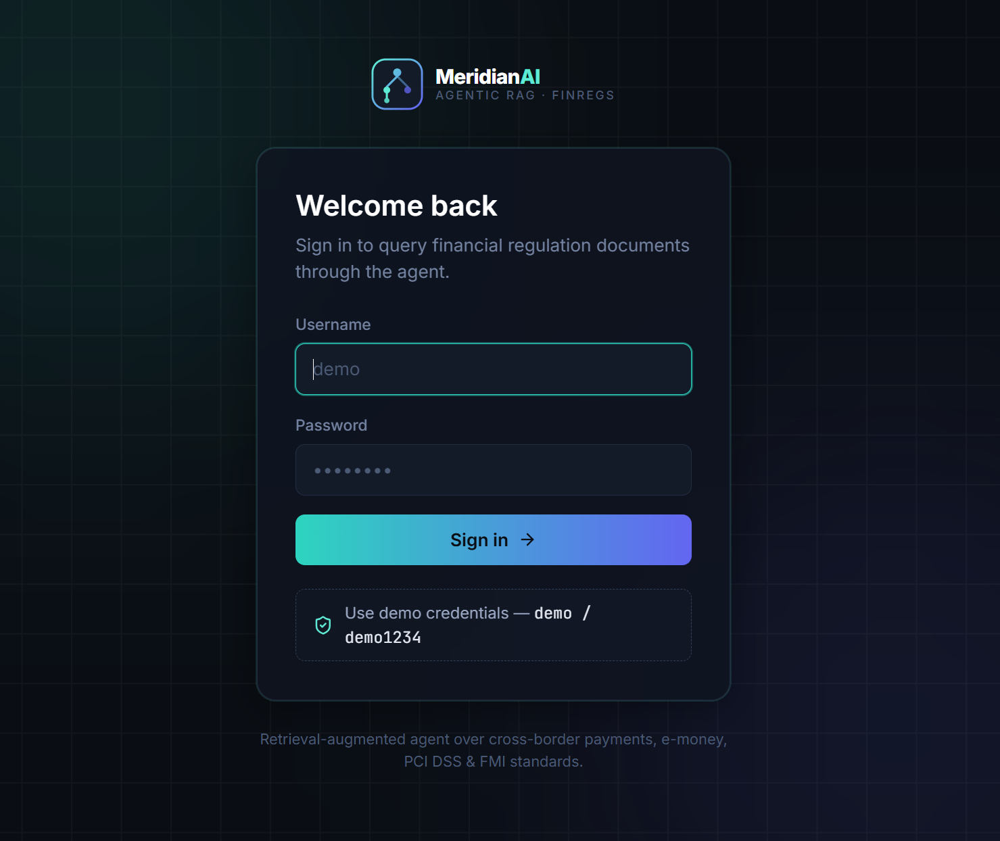
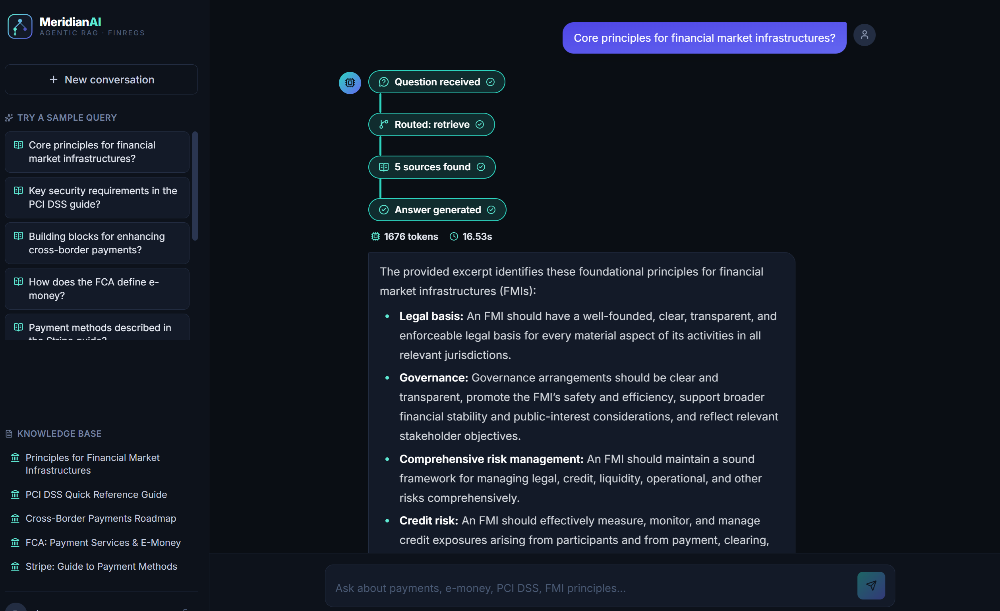
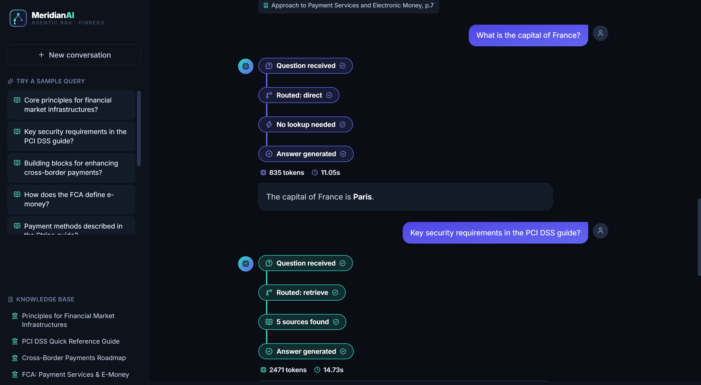

# MeridianAI — Agentic RAG for Financial Regulations

An Agentic Retrieval-Augmented Generation (RAG) system that answers questions about
payments, e-money, PCI DSS, and financial market infrastructure regulation — with an
agent that decides, per question, whether it needs to search the source documents at
all, or can just answer directly.

A LangGraph agent, a FastAPI backend, and a React chat UI, wired end to end.

---

## 1. Project Goal

Build a complete Agentic RAG application that:

- Ingests real regulatory PDF documents, chunks and embeds them into a vector database.
- Lets an LLM-driven **agent** decide, per question, whether it needs to retrieve from
  those documents (`retrieve`) or can answer from general knowledge / conversation
  history alone (`direct`) — instead of always retrieving, like a plain RAG pipeline
  would.
- Generates grounded answers with **source citations** when it retrieves.
- Supports multi-turn **conversation** (follow-up questions that refer back to earlier
  turns).
- Is demonstrable end to end, with at least 10 varied queries proving retrieval,
  direct-answer routing, and conversation memory all work.

## 2. Project Description

The assignment goal above is implemented as three layers:

1. **`rag/` + `graph/`** — the actual Agentic RAG pipeline: PDF ingestion, chunking,
   embeddings, Qdrant vector search, and a LangGraph state machine (`route → retrieve? →
   generate`) that does the agentic decision-making and answer generation. This is the
   part that satisfies every core requirement of the assignment and can be run entirely
   from the command line (`main.py` / `tests/test_queries.py`) with no UI at all.
2. **`api/`** — a thin FastAPI wrapper around that same pipeline (`/api/login`,
   `/api/chat`), so a browser can talk to it. It does not contain any RAG logic itself —
   it just calls `graph.graph.run(...)`.
3. **`frontend/`** — a React + Tailwind chat UI ("MeridianAI") with a demo login screen
   and a live, color-coded trace of the agent's routing decision (retrieve vs. direct),
   citations, token count, and response time for every answer. This layer exists to make
   the agent's behavior demonstrable and presentable (e.g. for a walkthrough video) — it
   is not required to satisfy the core RAG requirements, which are fully met by layer 1
   alone.

You can use this project either as a **pure Python CLI** (steps 1–4 in Setup) or with
the **full web UI** (all Setup steps) — both exercise the exact same agent.

## 3. What the agent actually does

```
route()      — an LLM call classifies the question as "retrieve" or "direct"
retrieve()   — (only if "retrieve") embeds the question, does a top-5 similarity
                search against Qdrant
generate()   — writes the answer; if chunks were retrieved, cites them by
                document title + page number
```

- **Domain question** ("What are the core principles for financial market
  infrastructures?") → routed to `retrieve`, answered from the actual PDFs, with
  citations.
- **General knowledge / small talk** ("What is 15% of 200?", "Hi, how are you?") →
  routed to `direct`, answered without touching the vector DB, no citations.
- **Follow-up question** ("Which of those principles relates to operational risk?") →
  conversation history is threaded through every turn, so the agent can resolve "those"
  and "that" from earlier in the same session.

`tests/test_queries.py` runs 12 such questions in one shared conversation — 5 that must
retrieve, 4 general-knowledge questions that must not, 1 deliberately tricky edge case,
and 2 follow-ups that only work if conversation memory is wired correctly — as a single
scripted demonstration of every requirement above.

## 4. End-to-end architecture



The compiled LangGraph state machine itself (generated by
`scripts/generate_graph_image.py`):



## 5. Screenshots

| Login | Retrieval route (with citations) |
|---|---|
|  |  |

| Direct route vs. retrieve route, same conversation |
|---|
|  |

Each answer shows a live, vertical trace of the agent's decision (question received →
routed → retrieved/skipped → answer generated), plus the tokens used and response time,
colored teal for `retrieve` and indigo for `direct`.

## 6. Repository structure

```
AgRAGSystem/
├── data/                      Source PDFs + manifest.json (title/publisher per file,
│                              used to build readable citations)
├── rag/
│   ├── ingest.py              Ingestion pipeline: load → chunk → embed → upsert
│   ├── embedding.py           EURI embedding client (batched)
│   ├── chat_model.py          EURI chat completion client (+ token counting)
│   └── vector_store.py        Qdrant client wrapper (create/upsert/query)
├── graph/
│   ├── state.py                Shared GraphState passed between nodes
│   ├── node.py                 route() / retrieve() / generate() node logic
│   └── graph.py                Wires the nodes into a LangGraph StateGraph
├── api/
│   └── server.py               FastAPI app: /api/login, /api/chat, /api/health
├── frontend/                   React + Vite + Tailwind chat UI
│   └── src/
│       ├── pages/               Login.jsx, Chat.jsx
│       ├── components/          MessageBubble.jsx, pipeline/InlineTrace.jsx, Logo.jsx
│       └── lib/api.js           Fetch wrapper calling the FastAPI backend
├── tests/
│   ├── test_connection.py      Smoke test for the EURI embedding/chat clients
│   └── test_queries.py         Scripted 12-question demo (routing + citations + memory)
├── scripts/
│   └── generate_graph_image.py Renders images/graph.png from the compiled graph
├── images/                     Screenshots + graph diagram used in this README
├── main.py                     Interactive CLI entry point (no UI needed)
├── requirements.txt
├── .env.example
└── README.md
```

## 7. Setup

### Prerequisites

- Python 3.10+
- Node.js 18+ (for the frontend)
- A Qdrant instance — the free tier of [Qdrant Cloud](https://cloud.qdrant.io/) works
  fine, or run one locally with `docker run -p 6333:6333 qdrant/qdrant`
- An API key for an OpenAI-compatible chat + embedding endpoint (this project was built
  against [EURI](https://euron.one/); any OpenAI-compatible router works — set
  `EURI_BASE_URL` accordingly)

### 7.1 Clone and configure

```bash
git clone https://github.com/saurabhkamal/AgenticRAGSystem-FinRegs.git
cd AgenticRAGSystem-FinRegs
cp .env.example .env
```

Fill in `.env`:

```ini
EURI_EMBED_MODEL=<your embedding model name>
CHAT_MODEL=<your chat model name>
EURI_BASE_URL=<your OpenAI-compatible router base URL>
EURI_API_KEY=<your API key>
QDRANT_URL=<your Qdrant cluster URL>
QDRANT_API_KEY=<your Qdrant API key>
QDRANT_COLLECTION=<a name for the collection, e.g. finregs_docs>

# demo login for the React frontend
DEMO_USER=demo
DEMO_PASSWORD=demo1234
```

### 7.2 Python environment

```bash
python -m venv .venv
.venv\Scripts\activate        # Windows
source .venv/bin/activate     # macOS/Linux

pip install -r requirements.txt
```

### 7.3 Ingest the documents (run once)

Populates Qdrant with embedded chunks from every PDF in `data/`:

```bash
python -m rag.ingest
```

### 7.4 Run it

**Option A — command line, no UI:**

```bash
python main.py
```

or run the scripted 12-question demonstration:

```bash
python -m tests.test_queries
```

**Option B — full web app:**

```bash
# terminal 1 — backend API
uvicorn api.server:app --reload

# terminal 2 — frontend
cd frontend
npm install
npm run dev
```

Open `http://localhost:5173`, sign in with the demo credentials shown on the login
screen (`demo` / `demo1234` by default — configurable via `.env`), and start asking
questions. The sidebar includes 10 ready-made sample queries covering both routing
paths.

### 7.5 Regenerating the graph diagram (optional)

If you change `graph/graph.py`, refresh `images/graph.png`:

```bash
python -m scripts.generate_graph_image
```

## 8. Tech stack

| Layer | Tech |
|---|---|
| Orchestration | LangGraph |
| Vector database | Qdrant |
| LLM / embeddings | OpenAI-compatible chat + embedding API (EURI) |
| PDF parsing | pdfplumber |
| Backend API | FastAPI |
| Frontend | React, Vite, Tailwind CSS |

## 9. Notes for anyone extending this

- Chunking is currently fixed-size character chunking (`CHUNK_SIZE`/`CHUNK_OVERLAP` in
  `rag/ingest.py`) — no semantic chunking or overlap-aware sentence boundaries; a good
  first improvement if extending this project.
- `data/manifest.json` maps raw PDF filenames to a clean citation title/publisher — add
  an entry here whenever you drop a new PDF into `data/`, then re-run `rag.ingest`.
- The agent's routing decision is a single LLM call with a strict `retrieve`/`direct`
  reply; if the model returns anything unexpected, `graph/node.py` defaults to
  `retrieve` (safer to over-fetch than to silently hallucinate on a regulatory
  question).
- The FastAPI layer is intentionally stateless per request — the full conversation
  history is sent by the client on every call (see `frontend/src/pages/Chat.jsx`), the
  same pattern `main.py` and `tests/test_queries.py` use.

---

## Links

- **GitHub repository:** https://github.com/saurabhkamal/AgenticRAGSystem-FinRegs
- **YouTube walkthrough:** _coming soon_
- **Connect on LinkedIn:** https://www.linkedin.com/in/saurabh-kamal/
